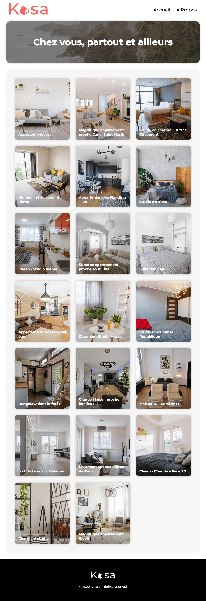

# Kasa - Projet de Refonte Front-End

Dans le cadre de ma formation en développement web chez OpenClassrooms, j'ai réalisé un projet consistant à recréer l'interface front-end d'un site de location immobilière à partir d'une maquette Figma.

[Voir la démo en ligne](https://hichxm.github.io/openclassrooms-kasa/)

## Contrainte technique

Le projet devait respecter les contraintes suivantes :

- [x] Utilisation de **Vite** comme bundler
- [x] Développement avec **React** et **React Router**
- [x] Stylisation avec **SASS**
- [x] **Aucune dépendance externe** autre que celles imposées
- [x] Composants **modulaires et réutilisables**
- [x] Un composant par fichier
- [x] Animation obligatoire pour les composants Dropdown et Slideshow
- [x] Gestion des **erreurs 404**
- [x] Utilisation d’**un fichier JSON local** comme source de données simulée
- [x] **Préparation de l’architecture de l’application** pour l’intégration d’un **futur backend**

### Gestion des données

Les données affichées dans l’application (logements, information diver, etc.) proviennent d’un fichier JSON local, servant ici de mock API.

Toute l’architecture a été pensée pour faciliter une transition ultérieure vers une API REST réelle, en isolant la logique de récupération et de traitement des données.

## Aperçu

## Maquette

[Accéder à la maquette sur Figma](https://www.figma.com/design/2BZEoBhyxt5IwZgRn0wGsL/Kasa_FR)